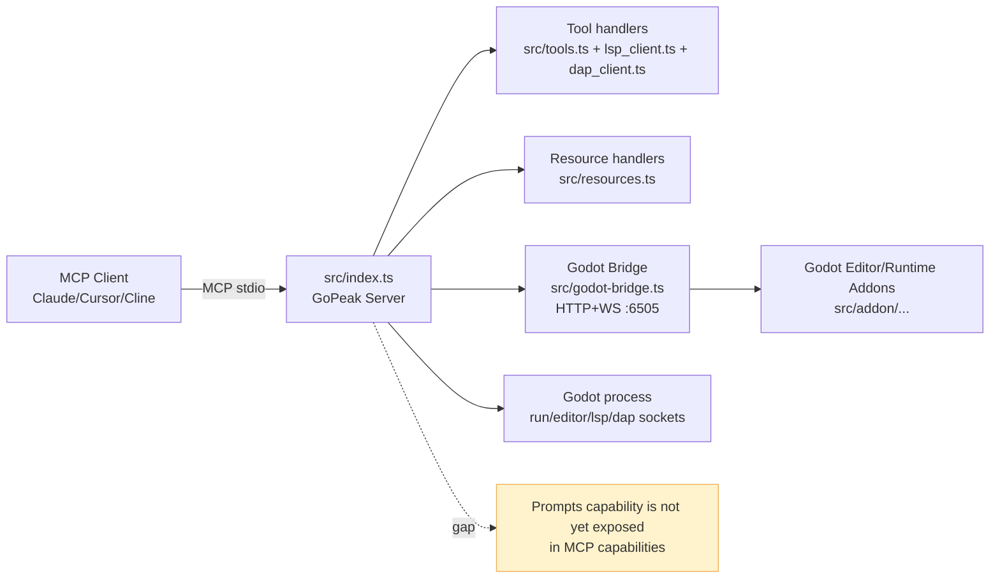
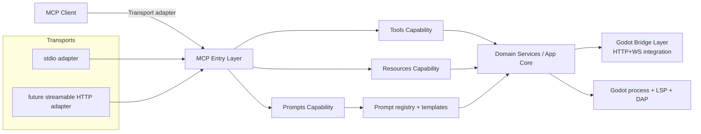

# GoPeak MCP Platform Architecture

> Scope: repository-specific architecture for evolving `godot-mcp` from a tool-centric server into a balanced MCP platform (tools + resources + prompts), with explicit transport boundaries and verification discipline.

## Why this document

The current codebase already has strong tool coverage and an initial resources layer:

- Server bootstrap and request handling: `src/index.ts`
- Tool definitions/dispatch: `src/tools.ts` (+ LSP/DAP helpers)
- Resource handlers: `src/resources.ts`
- Godot bridge (HTTP + WS for editor/runtime integration): `src/godot-bridge.ts`
- Current MCP package transport declaration: `server.json` (`stdio`)

The next step is to make this architecture explicit and prepare a safe path for platform growth.

---

## Current State (as implemented)

### Current architecture facts

1. **MCP transport is stdio-first** for client/server communication (`server.json`, `StdioServerTransport` in `src/index.ts`).
2. **Bridge transport is separate and internal**: the Godot bridge exposes HTTP/WS endpoints for addon/runtime integration (`src/godot-bridge.ts`).
3. **Tools are mature** and broad (project/scene/script/runtime/LSP/DAP/visualizer families).
4. **Resources exist but are narrow** (`godot://project/info`, `godot://scene/{path}`, `godot://script/{path}`, `godot://resource/{path}`).
5. **Prompts are already exposed as a first-class MCP capability** alongside tools and resources.

---

## Target State (platform direction)

### Target principles

- **Capability parity**: platform supports tools, resources, and prompts as peer capabilities.
- **Transport isolation**: MCP transport adapters are cleanly separated from app/core logic.
- **Deterministic contracts**: tools/resources/prompts have versioned schemas and behavior tests.
- **Backward-safe evolution**: compact/full tool profiles and existing aliases continue to work.

---

## Module boundaries (proposed)

These boundaries map to existing files and planned additions; they are design boundaries first, not a forced immediate refactor.

### 1) MCP entry layer

- **Today**: mostly in `src/index.ts`
- **Responsibility**:
  - server construction + capability registration
  - transport wiring (stdio now; additional adapters later)
  - request routing to capability handlers
- **Rule**: no direct Godot business logic in transport handlers.

### 2) Capability modules

- **Tools module**: existing `src/tools.ts`, `src/lsp_client.ts`, `src/dap_client.ts`
- **Resources module**: existing `src/resources.ts`
- **Prompts module (new)**: prompt templates + parameterized prompt endpoints
- **Rule**: each capability owns its schema definitions and validation.

### 3) Domain services / app core

- **Today**: spread across `src/index.ts`, `src/project_utils.ts`, `src/gdscript_utils.ts`, parser/util modules
- **Responsibility**:
  - project path lifecycle
  - process orchestration
  - file operation policy
  - reusable operation primitives consumed by tools/resources/prompts
- **Rule**: no transport-specific types in core logic.

### 4) Integration layer

- **Bridge**: `src/godot-bridge.ts` + addons in `src/addon/...`
- **Engine protocols**: LSP/DAP clients and Godot process interactions
- **Rule**: integration errors map to stable MCP error surfaces.

---

## Transport split contract

To avoid coupling regressions, define an explicit split:

- **MCP Client Transport**: how external clients talk to GoPeak (currently stdio; future HTTP option).
- **Godot Integration Transport**: how GoPeak talks to Godot/editor runtime (bridge HTTP+WS, LSP, DAP, runtime socket).

These two transport domains should evolve independently.

---

## Verification discipline (required for platform changes)

For any change that touches MCP capabilities or transport:

1. **Capability registration checks**
   - Verify declared capabilities match implemented handlers (tools/resources/prompts).
2. **Schema checks**
   - Validate input/output schema compatibility for new/changed tools/resources/prompts.
3. **Transport checks**
   - Confirm stdio flow remains functional (`npx -y gopeak`, inspector/manual smoke).
   - For bridge-related changes, verify `/health`, websocket connection, and at least one tool round-trip.
4. **Regression checks**
   - Keep compact profile discoverability (`tool.catalog`) working.
   - Confirm legacy aliases still resolve.
5. **Release artifact checks**
   - `npm run build` success and package metadata consistency (`package.json`, `server.json`).

---

## Non-goals for this architecture step

- No forced large refactor in one PR.
- No immediate deprecation of legacy tool names.
- No transport expansion without compatibility tests.

This document defines the architectural baseline for incremental implementation in `docs/platform-roadmap.md`.
